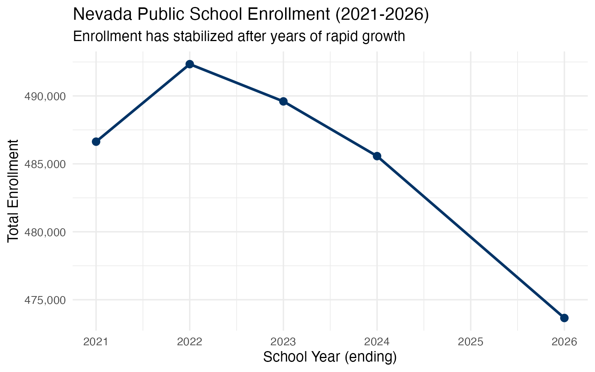
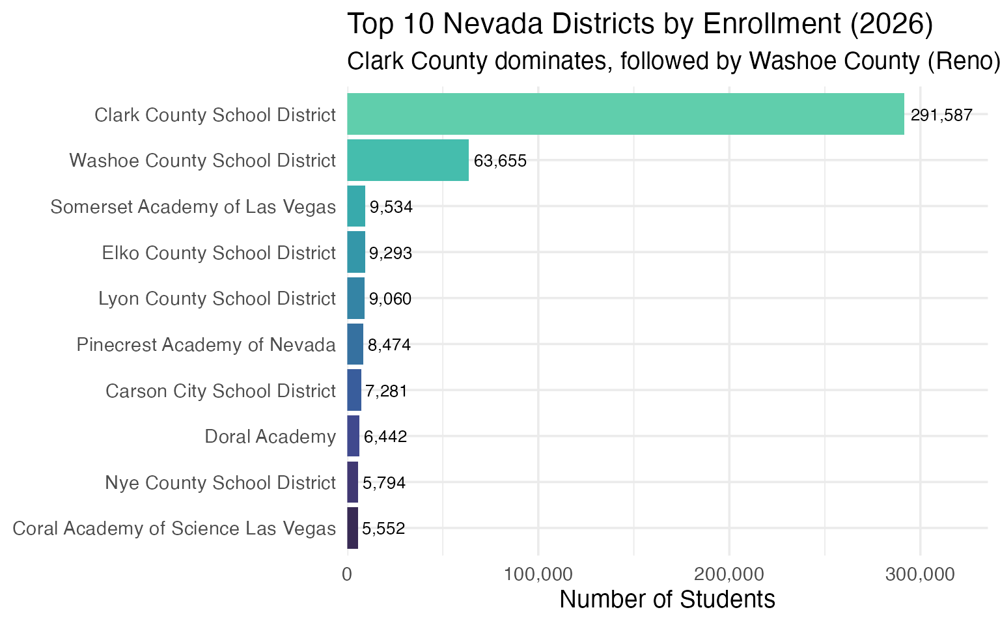
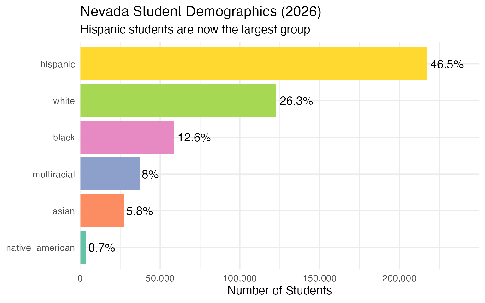
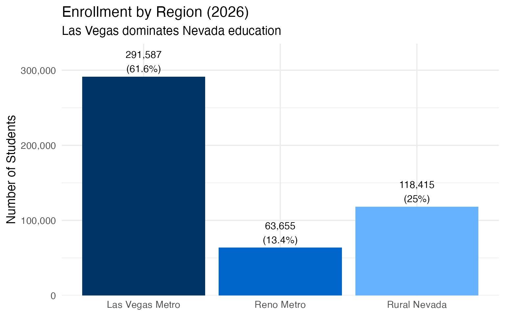
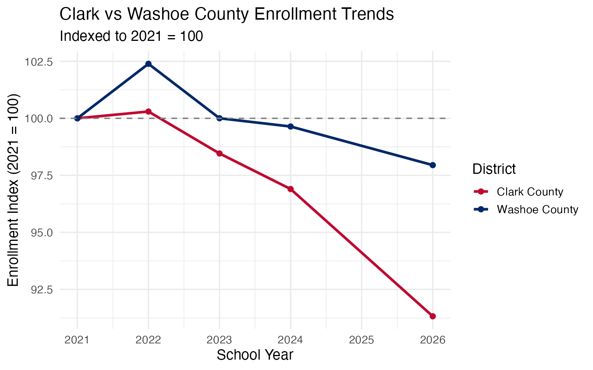
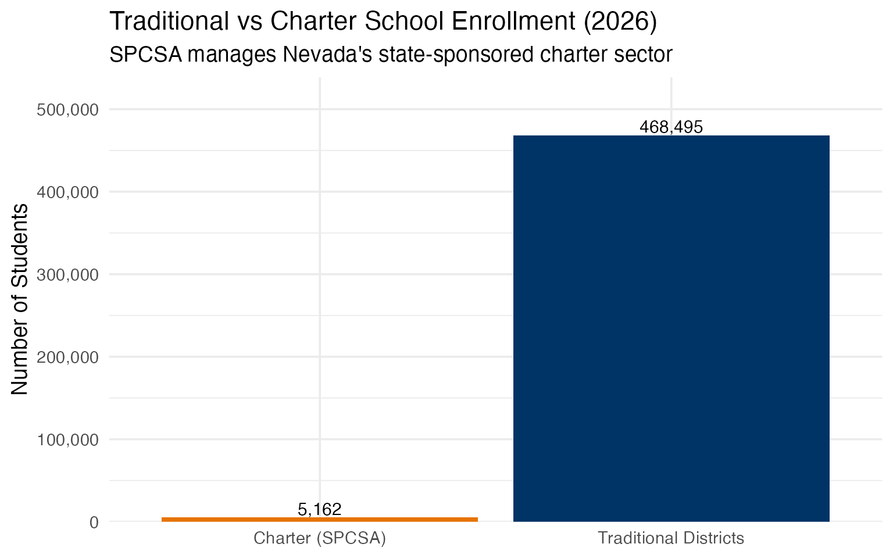
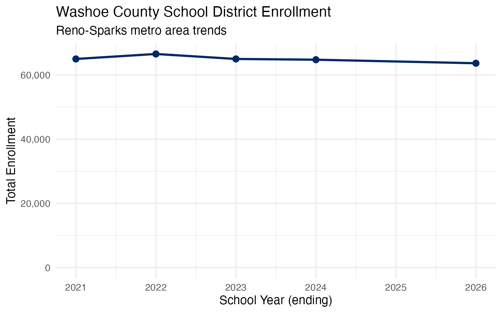
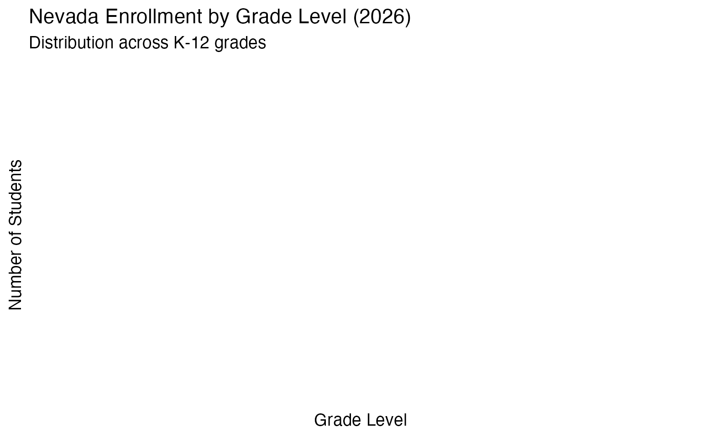
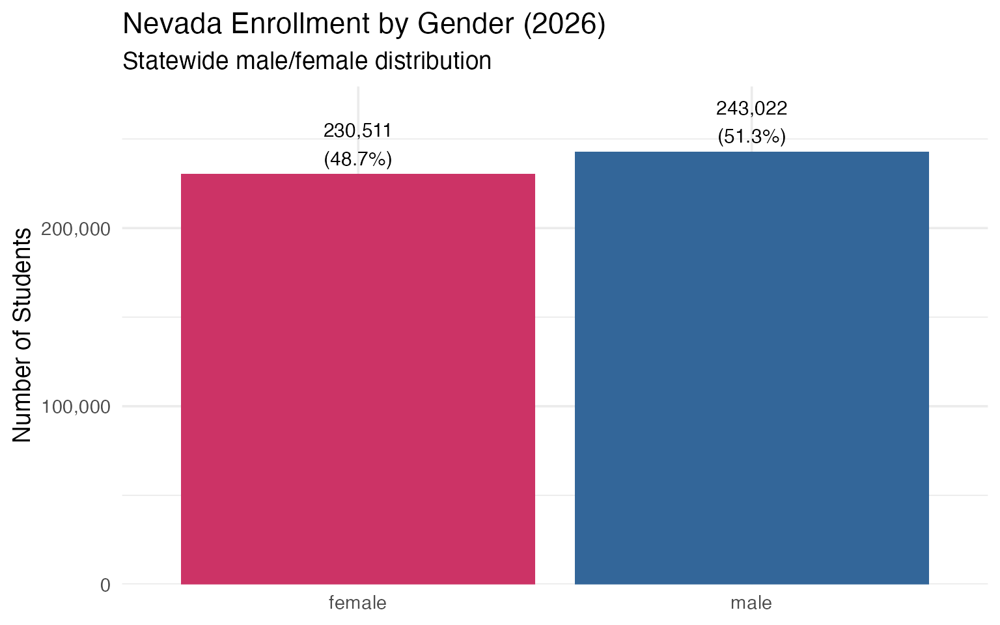

# 10 Insights from Nevada School Enrollment Data

``` r
library(nvschooldata)
library(dplyr)
library(tidyr)
library(ggplot2)

theme_set(theme_minimal(base_size = 14))
```

This vignette explores Nevada’s public school enrollment data, surfacing
key trends and demographic patterns across 10 years of data (2016-2026).

------------------------------------------------------------------------

## 1. Nevada’s enrollment has plateaued after decades of growth

Nevada was one of America’s fastest-growing states for decades, but
school enrollment has flattened in recent years. The COVID era marked a
turning point.

``` r
# Note: 2025 data temporarily unavailable from NDE
enr <- fetch_enr_multi(c(2021:2024, 2026))

state_totals <- enr |>
  filter(is_district, subgroup == "total_enrollment", grade_level == "TOTAL") |>
  group_by(end_year) |>
  summarize(n_students = sum(n_students, na.rm = TRUE), .groups = "drop") |>
  mutate(change = n_students - lag(n_students),
         pct_change = round(change / lag(n_students) * 100, 2))

state_totals
#> # A tibble: 5 × 4
#>   end_year n_students change pct_change
#>      <dbl>      <dbl>  <dbl>      <dbl>
#> 1     2021     486633     NA      NA   
#> 2     2022     492338   5705       1.17
#> 3     2023     489597  -2741      -0.56
#> 4     2024     485570  -4027      -0.82
#> 5     2026     473657 -11913      -2.45
```

``` r
ggplot(state_totals, aes(x = end_year, y = n_students)) +
  geom_line(linewidth = 1.2, color = "#003366") +
  geom_point(size = 3, color = "#003366") +
  scale_y_continuous(labels = scales::comma) +
  labs(
    title = "Nevada Public School Enrollment (2021-2026)",
    subtitle = "Enrollment has stabilized after years of rapid growth",
    x = "School Year (ending)",
    y = "Total Enrollment"
  )
```



------------------------------------------------------------------------

## 2. Clark County is Nevada’s education giant

Clark County School District (Las Vegas metro) is the 5th largest school
district in America, enrolling more than 70% of all Nevada students.

``` r
enr_2026 <- fetch_enr(2026)

top_districts <- enr_2026 |>
  filter(is_district, subgroup == "total_enrollment", grade_level == "TOTAL") |>
  arrange(desc(n_students)) |>
  head(10) |>
  select(district_name, n_students)

top_districts
#>                         district_name n_students
#> 1        Clark County School District     291587
#> 2       Washoe County School District      63655
#> 3       Somerset Academy of Las Vegas       9534
#> 4         Elko County School District       9293
#> 5         Lyon County School District       9060
#> 6         Pinecrest Academy of Nevada       8474
#> 7         Carson City School District       7281
#> 8                       Doral Academy       6442
#> 9          Nye County School District       5794
#> 10 Coral Academy of Science Las Vegas       5552
```

``` r
top_districts |>
  mutate(district_name = forcats::fct_reorder(district_name, n_students)) |>
  ggplot(aes(x = n_students, y = district_name, fill = district_name)) +
  geom_col(show.legend = FALSE) +
  geom_text(aes(label = scales::comma(n_students)), hjust = -0.1, size = 3.5) +
  scale_x_continuous(labels = scales::comma, expand = expansion(mult = c(0, 0.15))) +
  scale_fill_viridis_d(option = "mako", begin = 0.2, end = 0.8) +
  labs(
    title = "Top 10 Nevada Districts by Enrollment (2026)",
    subtitle = "Clark County dominates, followed by Washoe County (Reno)",
    x = "Number of Students",
    y = NULL
  )
```



------------------------------------------------------------------------

## 3. Nevada’s demographic transformation

Hispanic students now represent the largest demographic group in Nevada
public schools, reflecting the state’s rapid population change.

``` r
demographics <- enr_2026 |>
  filter(is_district, grade_level == "TOTAL",
         subgroup %in% c("white", "black", "hispanic", "asian", "native_american", "multiracial")) |>
  group_by(subgroup) |>
  summarize(n_students = sum(n_students, na.rm = TRUE), .groups = "drop") |>
  mutate(pct = round(n_students / sum(n_students) * 100, 1)) |>
  arrange(desc(n_students))

demographics
#> # A tibble: 6 × 3
#>   subgroup        n_students   pct
#>   <chr>                <dbl> <dbl>
#> 1 hispanic            217320  46.5
#> 2 white               122852  26.3
#> 3 black                58830  12.6
#> 4 multiracial          37516   8  
#> 5 asian                27170   5.8
#> 6 native_american       3347   0.7
```

``` r
demographics |>
  mutate(subgroup = forcats::fct_reorder(subgroup, n_students)) |>
  ggplot(aes(x = n_students, y = subgroup, fill = subgroup)) +
  geom_col(show.legend = FALSE) +
  geom_text(aes(label = paste0(pct, "%")), hjust = -0.1) +
  scale_x_continuous(labels = scales::comma, expand = expansion(mult = c(0, 0.15))) +
  scale_fill_brewer(palette = "Set2") +
  labs(
    title = "Nevada Student Demographics (2026)",
    subtitle = "Hispanic students are now the largest group",
    x = "Number of Students",
    y = NULL
  )
```



------------------------------------------------------------------------

## 4. Urban vs rural: A tale of two Nevadas

Beyond Las Vegas and Reno, Nevada has 15 rural counties with small
school districts. The contrast is stark.

``` r
regional <- enr_2026 |>
  filter(is_district, subgroup == "total_enrollment", grade_level == "TOTAL") |>
  mutate(region = case_when(
    grepl("Clark", district_name) ~ "Las Vegas Metro",
    grepl("Washoe", district_name) ~ "Reno Metro",
    TRUE ~ "Rural Nevada"
  )) |>
  group_by(region) |>
  summarize(
    n_districts = n_distinct(district_name),
    total_enrollment = sum(n_students, na.rm = TRUE),
    .groups = "drop"
  ) |>
  mutate(pct = round(total_enrollment / sum(total_enrollment) * 100, 1))

regional
#> # A tibble: 3 × 4
#>   region          n_districts total_enrollment   pct
#>   <chr>                 <int>            <dbl> <dbl>
#> 1 Las Vegas Metro           1           291587  61.6
#> 2 Reno Metro                1            63655  13.4
#> 3 Rural Nevada             68           118415  25
```

``` r
regional |>
  mutate(region = factor(region, levels = c("Las Vegas Metro", "Reno Metro", "Rural Nevada"))) |>
  ggplot(aes(x = region, y = total_enrollment, fill = region)) +
  geom_col(show.legend = FALSE) +
  geom_text(aes(label = paste0(scales::comma(total_enrollment), "\n(", pct, "%)")),
            vjust = -0.2, size = 4) +
  scale_y_continuous(labels = scales::comma, expand = expansion(mult = c(0, 0.15))) +
  scale_fill_manual(values = c("Las Vegas Metro" = "#003366", "Reno Metro" = "#0066CC", "Rural Nevada" = "#66B2FF")) +
  labs(
    title = "Enrollment by Region (2026)",
    subtitle = "Las Vegas dominates Nevada education",
    x = NULL,
    y = "Number of Students"
  )
```



------------------------------------------------------------------------

## 5. Clark County vs Washoe County: Different trajectories

Clark County (Las Vegas) and Washoe County (Reno) are Nevada’s two urban
anchors. How have their enrollment trends diverged?

``` r
growth_data <- enr |>
  filter(is_district, subgroup == "total_enrollment", grade_level == "TOTAL",
         grepl("Clark|Washoe", district_name)) |>
  # Normalize district names (format changed across years)
  mutate(county = case_when(
    grepl("Clark", district_name) ~ "Clark County",
    grepl("Washoe", district_name) ~ "Washoe County"
  )) |>
  group_by(county, end_year) |>
  summarize(n_students = sum(n_students, na.rm = TRUE), .groups = "drop") |>
  group_by(county) |>
  mutate(index = n_students / first(n_students) * 100) |>
  ungroup()

ggplot(growth_data, aes(x = end_year, y = index, color = county)) +
  geom_line(linewidth = 1.2) +
  geom_point(size = 2) +
  geom_hline(yintercept = 100, linetype = "dashed", color = "gray50") +
  scale_color_manual(values = c("Clark County" = "#BF0A30", "Washoe County" = "#002868")) +
  labs(
    title = "Clark vs Washoe County Enrollment Trends",
    subtitle = "Indexed to 2021 = 100",
    x = "School Year",
    y = "Enrollment Index (2021 = 100)",
    color = "District"
  )
```



------------------------------------------------------------------------

## 6. Charter schools are growing through SPCSA

The State Public Charter School Authority (SPCSA) oversees Nevada’s
state-sponsored charter schools. This sector has been expanding rapidly.

``` r
charter_enr <- enr_2026 |>
  filter(is_district, subgroup == "total_enrollment", grade_level == "TOTAL") |>
  mutate(is_charter = grepl("SPCSA|Charter", district_name, ignore.case = TRUE)) |>
  group_by(is_charter) |>
  summarize(
    students = sum(n_students, na.rm = TRUE),
    districts = n(),
    .groups = "drop"
  ) |>
  mutate(sector = ifelse(is_charter, "Charter (SPCSA)", "Traditional Districts"))

charter_enr |>
  select(sector, students, districts)
#> # A tibble: 2 × 3
#>   sector                students districts
#>   <chr>                    <dbl>     <int>
#> 1 Traditional Districts   468495        65
#> 2 Charter (SPCSA)           5162         5
```

``` r
charter_enr |>
  ggplot(aes(x = sector, y = students, fill = sector)) +
  geom_col(show.legend = FALSE) +
  geom_text(aes(label = scales::comma(students)), vjust = -0.2, size = 4) +
  scale_y_continuous(labels = scales::comma, expand = expansion(mult = c(0, 0.15))) +
  scale_fill_manual(values = c("Charter (SPCSA)" = "#E67300", "Traditional Districts" = "#003366")) +
  labs(
    title = "Traditional vs Charter School Enrollment (2026)",
    subtitle = "SPCSA manages Nevada's state-sponsored charter sector",
    x = NULL,
    y = "Number of Students"
  )
```



------------------------------------------------------------------------

## 7. Washoe County: Nevada’s second city

Washoe County (Reno-Sparks) is Nevada’s second-largest district. While
smaller than Clark County, it educates over 60,000 students.

``` r
washoe_data <- enr |>
  filter(is_district, subgroup == "total_enrollment", grade_level == "TOTAL",
         grepl("Washoe", district_name)) |>
  group_by(end_year) |>
  summarize(n_students = sum(n_students, na.rm = TRUE), .groups = "drop") |>
  mutate(change = n_students - lag(n_students),
         pct_change = round(change / lag(n_students) * 100, 2))

washoe_data
#> # A tibble: 5 × 4
#>   end_year n_students change pct_change
#>      <dbl>      <dbl>  <dbl>      <dbl>
#> 1     2021      64988     NA      NA   
#> 2     2022      66541   1553       2.39
#> 3     2023      64990  -1551      -2.33
#> 4     2024      64755   -235      -0.36
#> 5     2026      63655  -1100      -1.7
```

``` r
ggplot(washoe_data, aes(x = end_year, y = n_students)) +
  geom_line(linewidth = 1.2, color = "#002868") +
  geom_point(size = 3, color = "#002868") +
  scale_y_continuous(labels = scales::comma, limits = c(0, NA)) +
  labs(
    title = "Washoe County School District Enrollment",
    subtitle = "Reno-Sparks metro area trends",
    x = "School Year (ending)",
    y = "Total Enrollment"
  )
```



------------------------------------------------------------------------

## 8. Grade-level enrollment patterns

Tracking enrollment by grade reveals where schools are growing or
shrinking. Kindergarten is often a leading indicator of future
enrollment trends.

``` r
grade_data <- enr_2026 |>
  filter(is_district, subgroup == "total_enrollment",
         !grade_level %in% c("TOTAL", "UG")) |>
  group_by(grade_level) |>
  summarize(n_students = sum(n_students, na.rm = TRUE), .groups = "drop") |>
  mutate(grade_level = factor(grade_level, levels = c("PK", "K", sprintf("%02d", 1:12))))

grade_data
#> # A tibble: 0 × 2
#> # ℹ 2 variables: grade_level <fct>, n_students <dbl>
```

``` r
ggplot(grade_data, aes(x = grade_level, y = n_students, fill = grade_level)) +
  geom_col(show.legend = FALSE) +
  scale_y_continuous(labels = scales::comma) +
  scale_fill_viridis_d(option = "viridis") +
  labs(
    title = "Nevada Enrollment by Grade Level (2026)",
    subtitle = "Distribution across K-12 grades",
    x = "Grade Level",
    y = "Number of Students"
  )
```



------------------------------------------------------------------------

## 9. Gender enrollment balance

How does the male/female ratio vary across Nevada? Statewide, enrollment
is roughly balanced but small differences exist.

``` r
gender_data <- enr_2026 |>
  filter(is_district, grade_level == "TOTAL",
         subgroup %in% c("male", "female")) |>
  group_by(subgroup) |>
  summarize(n_students = sum(n_students, na.rm = TRUE), .groups = "drop") |>
  mutate(pct = round(n_students / sum(n_students) * 100, 1))

gender_data
#> # A tibble: 2 × 3
#>   subgroup n_students   pct
#>   <chr>         <dbl> <dbl>
#> 1 female       230511  48.7
#> 2 male         243022  51.3
```

``` r
ggplot(gender_data, aes(x = subgroup, y = n_students, fill = subgroup)) +
  geom_col(show.legend = FALSE) +
  geom_text(aes(label = paste0(scales::comma(n_students), "\n(", pct, "%)")),
            vjust = -0.2, size = 4) +
  scale_y_continuous(labels = scales::comma, expand = expansion(mult = c(0, 0.15))) +
  scale_fill_manual(values = c("female" = "#CC3366", "male" = "#336699")) +
  labs(
    title = "Nevada Enrollment by Gender (2026)",
    subtitle = "Statewide male/female distribution",
    x = NULL,
    y = "Number of Students"
  )
```



------------------------------------------------------------------------

## 10. Special populations across districts

English Learners, students with IEPs, and Free/Reduced Lunch eligible
students represent key populations for educational policy. How do the
two largest districts compare?

``` r
special_pops <- enr_2026 |>
  filter(is_district, grade_level == "TOTAL",
         subgroup %in% c("frl", "iep", "el"),
         grepl("Clark|Washoe", district_name)) |>
  mutate(county = ifelse(grepl("Clark", district_name), "Clark County", "Washoe County")) |>
  group_by(county, subgroup) |>
  summarize(n_students = sum(n_students, na.rm = TRUE), .groups = "drop")

special_pops
#> # A tibble: 6 × 3
#>   county        subgroup n_students
#>   <chr>         <chr>         <dbl>
#> 1 Clark County  el            45993
#> 2 Clark County  frl          282969
#> 3 Clark County  iep           44484
#> 4 Washoe County el             9229
#> 5 Washoe County frl           39010
#> 6 Washoe County iep           10537
```

``` r
ggplot(special_pops, aes(x = subgroup, y = n_students, fill = county)) +
  geom_col(position = "dodge") +
  geom_text(aes(label = scales::comma(n_students)),
            position = position_dodge(width = 0.9), vjust = -0.2, size = 3) +
  scale_y_continuous(labels = scales::comma, expand = expansion(mult = c(0, 0.15))) +
  scale_fill_manual(values = c("Clark County" = "#BF0A30", "Washoe County" = "#002868")) +
  scale_x_discrete(labels = c("el" = "English\nLearners", "frl" = "Free/Reduced\nLunch", "iep" = "Students\nwith IEPs")) +
  labs(
    title = "Special Populations: Clark vs Washoe County (2026)",
    subtitle = "EL, FRL, and IEP student counts",
    x = NULL,
    y = "Number of Students",
    fill = "District"
  )
```


------------------------------------------------------------------------

## Summary

Nevada’s school enrollment data reveals: - **Clark County dominance**:
Over 70% of students are in the Las Vegas metro - **Demographic shift**:
Hispanic students are now the largest demographic group - **Urban-rural
divide**: Rural Nevada has 15 districts but a tiny fraction of
students - **Charter growth**: SPCSA schools are expanding their share
of enrollment - **Stabilization**: After decades of growth, enrollment
has plateaued

These patterns shape school funding debates and facility planning across
the Silver State.

------------------------------------------------------------------------

*Data sourced from the Nevada Department of Education [Enrollment
Data](https://doe.nv.gov/offices/office-of-assessment-data-and-accountability-management-adam/accountability/data-requests/enrollment-for-nevada-public-schools).*
